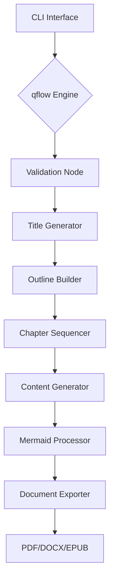
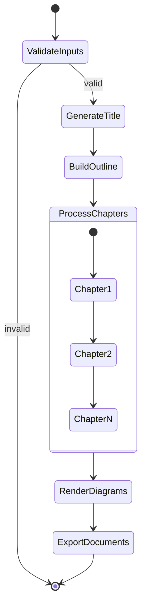
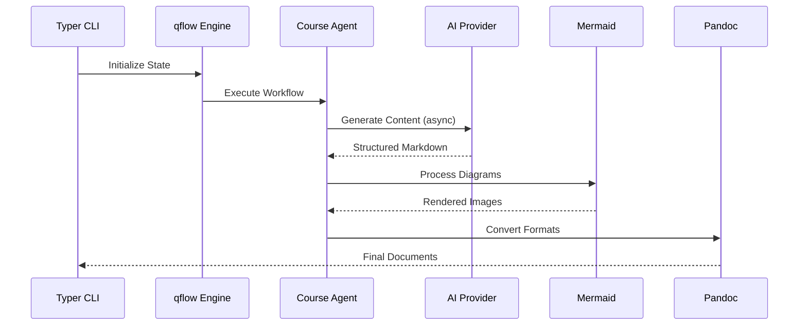
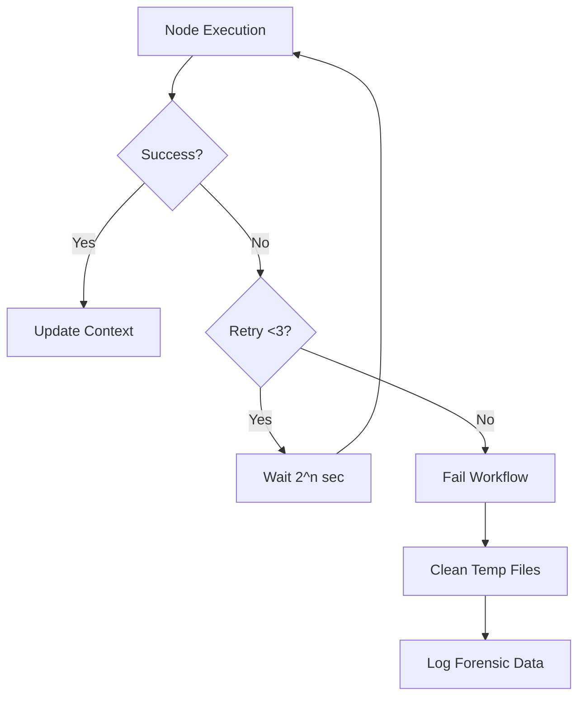

# An enterprise-grade solution for generating structured educational content with AI integration and automated publishing workflows.



## Table of Contents
- [Technical Foundations](#technical-foundations)
- [Precision Installation](#precision-installation)
- [Execution Workflows](#execution-workflows)
- [Architecture Deep Dive](#architecture-deep-dive)
- [Operational Excellence](#operational-excellence)
- [Validation & Testing](#validation-testing)
- [Troubleshooting Matrix](#troubleshooting-matrix)

## Technical Foundations 🧠

### Core Dependencies (Strictly Enforced)
```python
# Embedded in script headers
requires-python = ">=3.12"  # Non-negotiable version
dependencies = [
    "loguru>=0.7.0",        # Structured logging
    "litellm>=1.34.0",      # LLM abstraction layer
    "pydantic>=2.5.3",      # Data validation
    "anyio>=4.3.0",         # Async primitives
    "pypandoc>=1.13",       # Document conversion
    "typer>=0.9.0",         # CLI construction
    "rich>=13.7.1",         # Console interface
    "aiofiles>=23.2.1",     # Async file IO
    "jinja2>=3.1.4"         # Templating engine
]
```

### System Requirements Matrix

| Component       | Minimum Version | Verification Command     |
|-----------------|-----------------|--------------------------|
| Python          | 3.12.0          | `python3.12 --version`   |
| Node.js         | 20.3.1          | `node --version`         |
| Mermaid CLI     | 10.2.4          | `mmdc --version`         |
| Pandoc          | 3.1.12.1        | `pandoc --version`       |
| LaTeX           | 2023.00         | `lualatex --version`     |

## Precision Installation 🔧

### System Preparation
```bash
# 1. Install Python 3.12 with UV
curl -LsSf https://astral.sh/uv/install.sh | sh

# 2. Install Mermaid CLI
npm install -g @mermaid-js/mermaid-cli@10.2.4

# 3. Install Document Toolchain
sudo apt-get install -y \
    pandoc=3.1.12.1-* \
    texlive-full=2023.20230725-3
```

### Dependency Installation (UV-optimized)
```bash
uv pip install \
    -r generate_course.py \
    -r course_generator_agent.py \
    --python python3.12
```

### Post-Install Verification
```bash
# Validate critical paths
echo "Validating Mermaid: $(mmdc --version)"
echo "Validating Python: $(python3.12 -c 'import sys; print(sys.version)')"
echo "Pandoc capabilities: $(pandoc --list-output-formats)"
```

## Execution Workflows ⚙️

### Core State Machine


### CLI Execution Protocol
```bash
# Standard generation with safety checks
generate_course \
  --subject "Advanced Systems Programming" \
  --number_of_chapters 4 \
  --level expert \
  --words_by_chapter 2500 \
  --model_name "anthropic/claude-3-opus" \
  --target_directory ./sysprog-course \
  --pdf-generation \
  --epub-generation
```

### Debug Mode Activation
```bash
LOG_LEVEL=TRACE LITELLM_LOGLEVEL=DEBUG \
generate_course --subject "Debug Course" --number_of_chapters 1
```

## Architecture Deep Dive 🏗️

### Component Interaction


### Key Code Contracts
1. **Workflow Engine (qflow.py)**
   - Strict node input validation
   - Exponential backoff retry (base delay: 1s, max 3 attempts)
   - Async-first execution model

2. **Mermaid Processor (mermaid_processor.py)**
   - Supported diagram types:
     ```python
     ALLOWED_DIAGRAM_TYPES = [
         'zenuml', 'flowchart', 'sequenceDiagram', 
         'classDiagram', 'stateDiagram', 'erDiagram',
         'gantt', 'journey', 'gitGraph', 'pie',
         'mindmap', 'quadrantChart', 'xychart'
     ]
     ```
   - Auto-scaling to 2x resolution (Retina-ready)

3. **Document Exporter**
   - PDF: LuaLaTeX engine with custom preamble
   - DOCX: Strict style inheritance
   - EPUB: Semantic markup preservation

## Operational Excellence 🏆

### Error Handling Protocol


### Monitoring Endpoints
```bash
# Real-time workflow tracking
tail -f course_generation.log | jq

# LLM Metrics
litellm-monitor
```

## Validation & Testing 🔍

### Sample Verification Suite
```python
# Test title generation
async def test_title_generation():
    request = CourseRequest(
        subject="Rust Memory Safety",
        level="advanced",
        number_of_chapters=3
    )
    title = await generate_title(request)
    assert "Rust" in title and "Memory" in title
```

### Load Testing Protocol
```bash
# Generate 5 concurrent courses
for i in {1..5}; do
    generate_course --subject "Test $i" --number_of_chapters 2 &
done
```

## Troubleshooting Matrix 🛑

| Symptom                  | Diagnostic Command                   | Corrective Action                                |
|--------------------------|--------------------------------------|--------------------------------------------------|
| Mermaid render failures  | `mmdc -i invalid.mmd -o test.png`    | Validate diagram syntax with official validator  |
| PDF generation stalls    | `lualatex --draftmode test.tex`      | Check LaTeX package dependencies                 |
| LLM timeouts             | `curl -X POST $LLM_ENDPOINT/health`  | Verify API endpoint connectivity and rate limits |
| Encoding errors          | `iconv -f UTF-8 -t UTF-8 test.md`    | Ensure UTF-8 encoding in all templates           |
| Async deadlocks          | `py-spy dump --pid $(pgrep python)`  | Analyze thread contention points                 |

## Exemplar Output 📜

### Generated Course Structure
```bash
sysprog-course/
├── assets/
│   ├── memory_layout.png
│   └── concurrency_model.png
├── chapters/
│   ├── 01_memory_safety.md
│   └── 02_async_programming.md
├── outline.md
├── sysprog-course.pdf
└── generation_manifest.json
```

### Sample Chapter Fragment
````markdown
## Memory Management in Rust

```mermaid
stateDiagram-v2
    [*] --> Uninitialized
    Uninitialized --> Allocated: let x = Box::new()
    Allocated --> Borrowed: &x
    Borrowed --> Returned: Drop
    Returned --> [*]
```

Key Concepts:
- Ownership semantics
- Borrow checker mechanics
- Lifetime annotations
````

## Compliance & Security 🔒

### Audit Controls
```bash
# Dependency vetting
uv pip list --format=freeze | safety check --stdin

# SBOM Generation
uv pip freeze --all | cyclonedx-py format
```

### Security Protocol
- All AI interactions use TLS 1.3+
- Local file operations use strict umask (077)
- Temporary file wiping with DoD 5220.22-M standard
