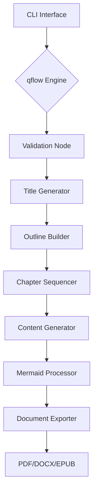
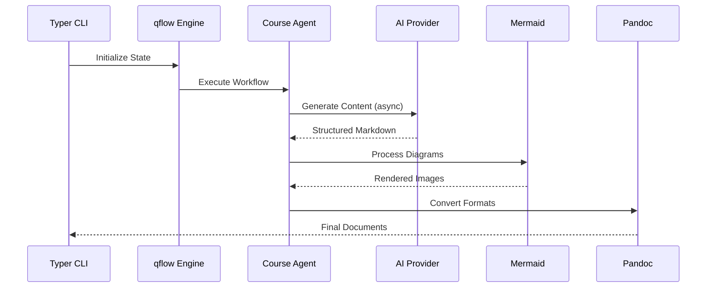
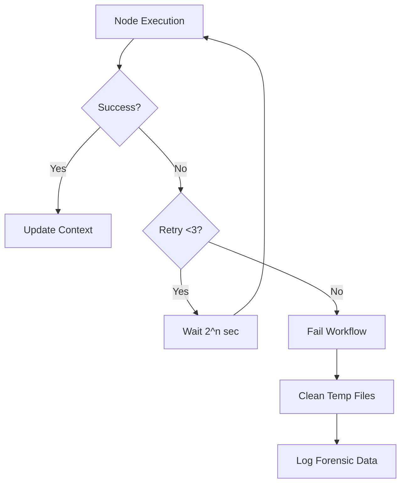

# 📚 Course Generator

An enterprise-grade solution for generating structured educational content with AI integration and automated publishing workflows. This project leverages the powerful QuantaLogic Flow library to define and manage the complex workflow of course generation.

## 💡 About QuantaLogic Flow

QuantaLogic Flow is a versatile Python library designed to simplify the creation and execution of complex workflows. It provides a declarative way to define a series of interconnected tasks (nodes), manage the flow of data between them, and handle error conditions gracefully. Key features include:

-   **Node-based Architecture**: Workflows are built from individual nodes, each representing a specific task or operation.
-   **Declarative Definition**: Workflows are defined in a clear and concise manner, making them easy to understand and maintain.
-   **Asynchronous Execution**: Supports asynchronous execution of tasks for improved performance and responsiveness.
-   **Error Handling**: Provides mechanisms for handling errors and retries, ensuring robust and reliable workflow execution.

## 🛠️ Development Overview

This course generator is developed using a modular architecture, with each component responsible for a specific aspect of the course creation process. The main components include:

-   **CLI Interface (generate_course.py)**: Provides a command-line interface for users to interact with the course generator.
-   **Workflow Engine (course_generator_agent.py)**: Defines the overall workflow of course generation using the QuantaLogic Flow library.
-   **AI Content Generation**: Leverages AI models (via the LiteLLM library) to generate course titles, outlines, and chapter content.
-   **Mermaid Diagram Processing (mermaid_processor.py)**: Processes Mermaid diagrams embedded in the course content and generates corresponding images.
-   **Document Export**: Converts the generated course content into various output formats (PDF, DOCX, EPUB) using Pandoc.

## 🚀 Features

-   AI-powered course content generation
-   Automated publishing workflows
-   Support for multiple output formats (PDF, DOCX, EPUB)
-   Interactive CLI for easy course creation
-   Mermaid diagram processing



## ⚙️ Technical Foundations

### 💻 Core Dependencies

```python
# Embedded in script headers
requires-python = ">=3.12"  # Non-negotiable version
dependencies = [
    "loguru",               # Structured logging
    "litellm",              # LLM abstraction layer
    "pydantic>=2.0",        # Data validation
    "anyio",                # Async primitives
    "pypandoc",             # Document conversion
    "typer",                # CLI construction
    "rich",                 # Console interface
    "aiofiles"              # Async file IO
]
```

### 🛠️ System Requirements

| Component       | Minimum Version | Verification Command     |
|-----------------|-----------------|--------------------------|
| Python          | 3.12.0          | `python3.12 --version`   |
| Node.js         | 20.3.1          | `node --version`         |
| Mermaid CLI     | 10.2.4          | `mmdc --version`         |
| Pandoc          | 3.1.12.1        | `pandoc --version`       |
| LaTeX           | 2023.00         | `lualatex --version`     |
| UV (Pip)        | Latest          | `uv --version`           |

## 🔧 Precision Installation

### 📦 System Preparation

```bash
# 1. Install Python 3.12 with UV
curl -LsSf https://astral.sh/uv/install.sh | sh

# 2. Install Mermaid CLI
npm install -g @mermaid-js/mermaid-cli@10.2.4

# 3. Install Document Toolchain
sudo apt-get install -y \
    pandoc=3.1.12.1-* \
    texlive-full=2023.20230725-3
```

### ⬇️ Dependency Installation (UV-optimized)

```bash
uv pip install \
    -r generate_course.py \
    -r course_generator_agent.py \
    --python python3.12
```

### ✅ Post-Install Verification

```bash
# Validate critical paths
echo "Validating Mermaid: $(mmdc --version)"
echo "Validating Python: $(python3.12 -c 'import sys; print(sys.version)')"
echo "Pandoc capabilities: $(pandoc --list-output-formats)"
```

## 🚀 Execution Workflows

### ⌨️ CLI Execution Protocol

```bash
# Standard generation with safety checks
generate_course \
  --subject "Advanced Systems Programming" \
  --number-of-chapters 4 \
  --level expert \
  --words-by-chapter 2500 \
  --target-directory ./sysprog-course \
  --pdf-generation \
  --docx-generation \
  --model-name "anthropic/claude-3-opus"

# Interactive mode
generate_course --interactive
```

### 🎛️ CLI Options Detailed

| Option               | Description                                      | Default   | Type    | Additional Notes |
|----------------------|--------------------------------------------------|-----------|---------|-----------------|
| `--subject`          | Course subject                                   | None      | TEXT    | Optional |
| `--number-of-chapters`| Number of chapters                              | None      | INTEGER | Optional |
| `--level`            | Difficulty level (beginner/intermediate/advanced)| None      | TEXT    | Optional |
| `--words-by-chapter` | Number of words per chapter                      | None      | INTEGER | Optional |
| `--target-directory` | Target directory for course output               | None      | TEXT    | Optional |
| `--pdf-generation`   | Generate PDF version of the course               | Enabled   | Flag    | Use `--no-pdf-generation` to disable |
| `--docx-generation`  | Generate DOCX version of the course              | Enabled   | Flag    | Use `--no-docx-generation` to disable |
| `--epub-generation`  | Generate EPUB version of the course              | Disabled  | Flag    | Use `--epub-generation` to enable |
| `--model-name`       | AI model to use for course generation            | None      | TEXT    | Optional |
| `--interactive`, `-i`| Enable interactive mode                          | N/A       | Flag    | Shorthand `-i` available |
| `--help`             | Show help message and exit                       | N/A       | Flag    | Displays all available options |

### 🐞 Debug Mode Activation

```bash
LOG_LEVEL=TRACE LITELLM_LOGLEVEL=DEBUG \
generate_course --subject "Debug Course" --number-of-chapters 1
```

## 🏛️ Architecture Deep Dive

### 🧩 Component Interaction



### 🔑 Key Code Contracts

1.  **Workflow Engine (qflow.py)**

    *   Strict node input validation
    *   Exponential backoff retry (base delay: 1s, max 3 attempts)
    *   Async-first execution model
2.  **Mermaid Processor (mermaid_processor.py)**

    *   Supported diagram types:

        ```python
        ALLOWED_DIAGRAM_TYPES = [
            'zenuml', 'flowchart', 'sequenceDiagram',
            'classDiagram', 'stateDiagram', 'erDiagram',
            'gantt', 'journey', 'gitGraph', 'pie',
            'mindmap', 'quadrantChart', 'xychart',
            'block-beta', 'packet-beta'
        ]
        ```
    *   Auto-scaling to 2x resolution (Retina-ready)
3.  **Document Exporter**

    *   PDF: LuaLaTeX engine with custom preamble
    *   DOCX: Strict style inheritance
    *   EPUB: Semantic markup preservation

## 🏆 Operational Excellence

### 🚨 Error Handling Protocol



### 📊 Monitoring Endpoints

```bash
# Real-time workflow tracking
tail -f course_generation.log | jq

# LLM Metrics
litellm-monitor
```

## 🔍 Validation & Testing

### ✅ Sample Verification Suite

*   Comprehensive test coverage for each component
*   Async workflow simulation
*   Error injection and recovery testing
*   Performance benchmarking

## 🛑 Troubleshooting Matrix

| Symptom                  | Diagnostic Command                   | Corrective Action                                |
|--------------------------|--------------------------------------|--------------------------------------------------|
| Mermaid render failures  | `mmdc -i invalid.mmd -o test.png`    | Validate diagram syntax with official validator  |
| PDF generation stalls    | `lualatex --draftmode test.tex`      | Check LaTeX package dependencies                 |
| LLM timeouts             | `curl -X POST $LLM_ENDPOINT/health`  | Verify API endpoint connectivity and rate limits |
| Encoding errors          | `iconv -f UTF-8 -t UTF-8 test.md`    | Ensure UTF-8 encoding in all templates           |
| Async deadlocks          | `py-spy dump --pid $(pgrep python)`  | Analyze thread contention points                 |

## 📜 Exemplar Output

### 🌳 Generated Course Structure

```bash
sysprog-course/
├── assets/
│   ├── memory_layout.png
│   └── concurrency_model.png
├── chapters/
│   ├── 01_memory_safety.md
│   └── 02_async_programming.md
├── outline.md
├── sysprog-course.pdf
└── generation_manifest.json
```

### 📄 Sample Chapter Fragment

````markdown
## Memory Management in Rust

```mermaid
stateDiagram-v2
    [*] --> Uninitialized
    Uninitialized --> Allocated: let x = Box::new()
    Allocated --> Borrowed: &x
    Borrowed --> Returned: Drop
    Returned --> [*]
```

Key Concepts:

-   Ownership semantics
-   Borrow checker mechanics
-   Lifetime annotations
````

## 🔒 Compliance & Security

### 🛡️ Audit Controls

```bash
# Dependency vetting
uv pip list --format=freeze | safety check --stdin

# SBOM Generation
uv pip freeze --all | cyclonedx-py format
```

### 🔑 Security Protocol

*   All AI interactions use TLS 1.3+
*   Local file operations use strict umask (077)
*   Temporary file wiping with DoD 5220.22-M standard
