<!-- Generated: 2025-06-19 00:28:38 UTC -->

# AI Course Generator

AI-powered educational content creation tool using QuantaLogic Flow workflows and multi-provider AI integration. Generates structured courses in PDF, DOCX, EPUB, and Markdown formats with customizable difficulty levels and comprehensive MCQ support.

## Key Entry Points

**Core Files:**
- `ai_course_generator/generate_course.py` - CLI interface with Typer framework
- `ai_course_generator/course_generator_agent.py` - Main workflow engine and AI integration  
- `pyproject.toml` - Build configuration and dependencies

## Quick Build & Run Commands

```bash
# Install dependencies (recommended)
poetry install

# Generate a course (example)
poetry run python -m ai_course_generator.generate_course --subject "Python" --level beginner --number-of-chapters 5 --words-by-chapter 500

# Alternative installation
pip install -r requirements.txt
```

## CLI Usage

The main entry point is a Typer-based CLI:

```bash
poetry run python -m ai_course_generator.generate_course --help
```

**Options include:**
- `--subject` / `-s`: Course subject
- `--number-of-chapters` / `-n`: Number of chapters
- `--level` / `-l`: Difficulty level (beginner/intermediate/advanced)
- `--words-by-chapter` / `-w`: Target word count per chapter
- `--target-directory` / `-o`: Output directory
- `--pdf/--no-pdf`: Generate PDF output
- `--docx/--no-docx`: Generate DOCX output
- `--epub/--no-epub`: Generate EPUB output
- `--model-name` / `-m`: AI model to use
- `--interactive` / `-i`: Interactive mode

## Workflow Overview


### Sequence of Operations

```mermaid
sequenceDiagram
    participant U as 👤 User
    participant CLI as 🖥️ CLI Interface
    participant WF as ⚙️ QuantaLogic Workflow
    participant AI as 🤖 AI Model (LLM)
    participant FS as 📁 File System

    U->>CLI: Submit course parameters
    CLI->>WF: Initialize workflow
    
    WF->>AI: Generate course title
    AI-->>WF: Return title
    
    WF->>AI: Generate course outline
    AI-->>WF: Return structured outline
    
    rect rgb(240, 248, 255)
        Note over WF,AI: Chapter Generation Loop
        loop For each chapter
            WF->>AI: Generate chapter content
            AI-->>WF: Return chapter text
            WF->>FS: Save chapter file
        end
    end
    
    WF->>WF: Compile full course
    WF->>FS: Generate output formats
    FS-->>CLI: Course files ready
    CLI-->>U: Course generation complete
```



## Dependencies

- Uses `quantalogic-flow >=0.6.3` (replaces deprecated `quantalogic`)
- See `pyproject.toml` and `requirements.txt` for full list

## Documentation

**LLM-Optimized Technical Reference:**

- **[docs/project-overview.md](docs/project-overview.md)** - Project purpose, technology stack, and platform requirements
- **[docs/architecture.md](docs/architecture.md)** - System organization, workflow components, and data flow with specific file references
- **[docs/build-system.md](docs/build-system.md)** - Build instructions, dependencies, and platform setup for all environments
- **[docs/development.md](docs/development.md)** - Code patterns, development workflows, and implementation examples from codebase
- **[docs/testing.md](docs/testing.md)** - Testing approach, commands, and CI/CD integration
- **[docs/deployment.md](docs/deployment.md)** - Packaging, distribution, and production deployment strategies
- **[docs/files.md](docs/files.md)** - Comprehensive file catalog with descriptions and dependency relationships

---

For advanced technical details, see [TECHNICAL_README.md](TECHNICAL_README.md).