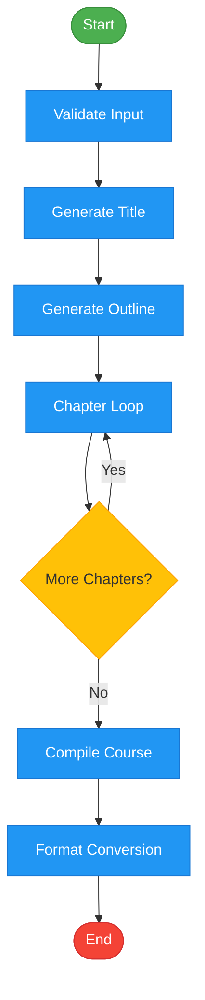
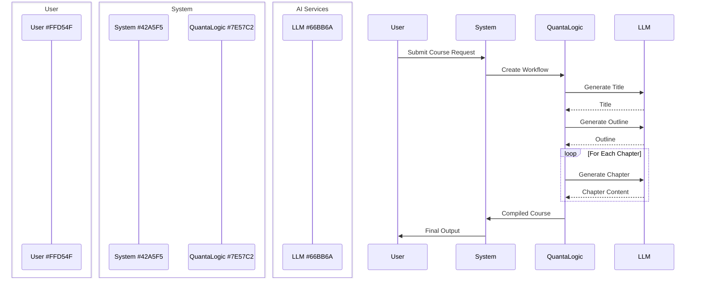
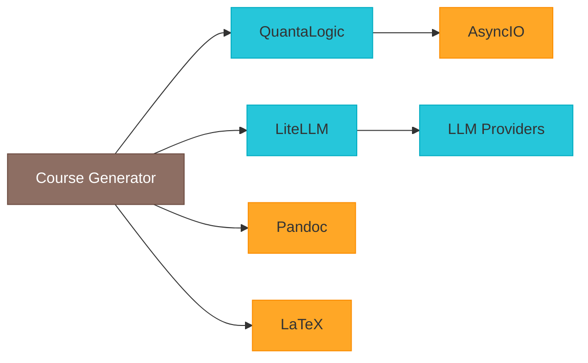

# Course Generator Technical Documentation

## Table of Contents
1. [Overview](#overview)
2. [Getting Started](#getting-started)
3. [Architecture](#architecture)
   - [Workflow Engine](#1-workflow-engine-quantalogic-flow)
   - [Processing Steps](#2-main-workflow-steps)
4. [API Reference](#api-reference)
5. [Troubleshooting](#troubleshooting)
6. [Contributing](#contributing)

## Overview
This document explains the architecture and workflow of the AI Course Generator that uses QuantaLogic Flow for content generation.



## Getting Started
### Installation
```bash
pip install -r requirements.txt
```

### Basic Usage
```python
from ai_course_generator import generate_course

result = generate_course(
    subject="Python Programming",
    chapters=5,
    level="intermediate"
)
```

## Architecture

### 1. Workflow Engine (QuantaLogic Flow)
Key Features:
- Node-based processing pipeline
- Automatic retry mechanism
- Real-time progress tracking

**Example Node Definition**:
```python
@Nodes.define(output="chapter_content")
async def generate_chapter(title, outline, chapter_num):
    """Generates chapter content with error handling"""
    try:
        return await generate_content(title, outline, chapter_num)
    except Exception as e:
        logger.error(f"Chapter generation failed: {e}")
        raise
```

### 2. Main Workflow Steps


## API Reference
### generate_course()
```python
def generate_course(
    subject: str,
    chapters: int,
    level: str = "intermediate",
    output_formats: List[str] = ["pdf", "docx"]
) -> Dict[str, Path]:
    """
    Generates complete course materials
    
    Args:
        subject: Course subject/topic
        chapters: Number of chapters to generate
        level: Difficulty level (beginner|intermediate|advanced)
        output_formats: List of output formats
    
    Returns:
        Dictionary mapping formats to file paths
    """
```

## Troubleshooting
### Common Issues
1. **Pandoc Not Found**
   ```bash
   sudo apt-get install pandoc
   ```

2. **LaTeX Missing**
   ```bash
   sudo apt-get install texlive-latex-base
   ```

3. **Chapter Generation Fails**
   - Check API key permissions
   - Verify network connectivity
   - Retry with reduced chapter length

## Contributing
1. Fork the repository
2. Create feature branch
3. Submit pull request

## Dependencies


**Version**: 1.0.0  
**Last Updated**: 2025-04-04
