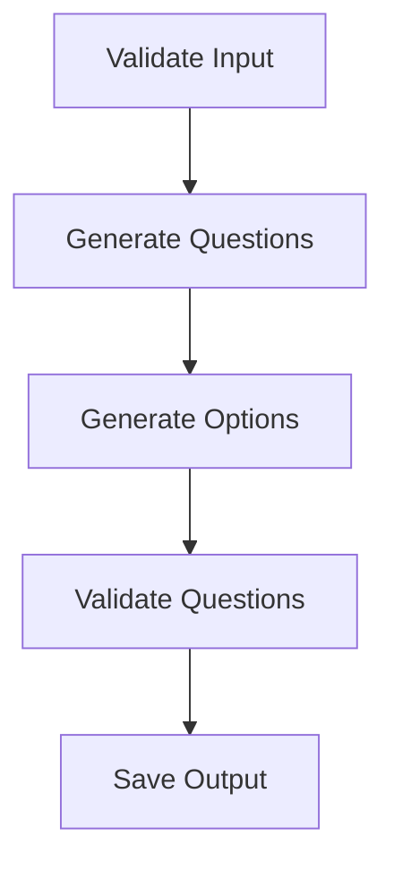

# MCQ Generator Specification

## Overview
This document specifies the Multiple Choice Question (MCQ) Generator module, built using the same architecture as the Course Generator but optimized for question generation.

## Architecture


## Components

### 1. MCQRequest Model
```python
class MCQRequest(BaseModel):
    topic: str
    difficulty: str  # beginner/intermediate/advanced
    num_questions: int
    num_options: int = 4
    target_directory: str
    output_formats: List[str] = ["json"]
    model_name: str = "gemini/gemini-2.0-flash"
    batch_size: int = 5
```

### 2. Workflow Nodes
- `validate_input`: Checks parameters
- `generate_questions`: Creates questions via LLM
- `generate_options`: Generates multiple choices
- `validate_question`: Ensures one correct answer
- `save_mcqs`: Outputs in specified formats

### 3. Observer Pattern
```python
async def mcq_stream_observer(event: WorkflowEvent):
    """Tracks progress of question generation"""
    # Implementation similar to course_generator_agent.py
```

## Output Formats
Supported formats:
1. JSON
2. CSV
3. Markdown
4. Quiz API format

## Dependencies
- quantalogic
- litellm
- pydantic

## Example Usage
```python
request = MCQRequest(
    topic="Python Decorators",
    difficulty="intermediate",
    num_questions=20,
    output_formats=["json", "md"]
)
await generate_mcqs(request)
```

## Roadmap
1. Web interface integration
2. Question difficulty calibration
3. Answer explanation generation
